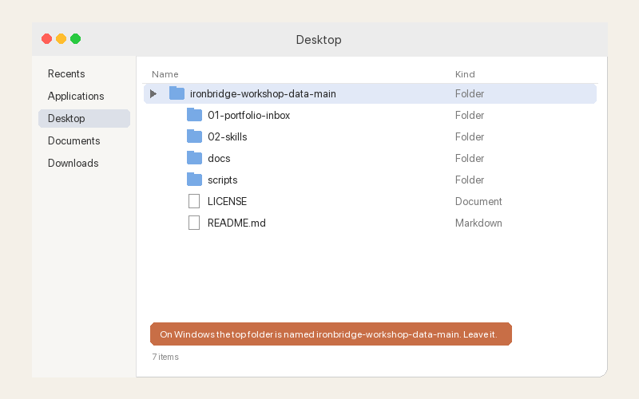

# Ironbridge workshop data: practice files for Claude Cowork

Practice files for a Claude Cowork workshop. One fictional company, one messy folder, one exercise that runs in six steps. Every file in this repository is synthetic: the company, the people, the merchants, the emails, the dollar figures. Any resemblance to a real business or person is a coincidence. The whole pack is released under CC0 (public domain), so use it however you like.

## The company

Ironbridge Payments is a payments processor in Dayton, Ohio, serving regulated and high-risk verticals: consumer and auto lenders, collections agencies, buy-now-pay-later providers and a handful of e-commerce merchants. It moves about $2.1 billion a year in ACH debits across 24 merchants and earns a per-item fee plus basis points on volume, by pricing tier. In the exercise you play Maya Okafor, VP of Merchant Services. The folder you are handed is what her analyst left behind before going on leave: twelve months of activity exports with inconsistent names, a merchant list, a pricing schedule, a risk policy, some saved emails, a chat export, and a few things that should not be there at all.

## How to get the files

1. Click the green **Code** button near the top of this page.

   

2. Choose **Download ZIP**.

   

3. Unzip it (double-click on a Mac; right-click and choose Extract All on Windows) and drag the folder to your Desktop.

   

**Windows note:** the folder unzips as `ironbridge-workshop-data-main`, not `ironbridge-workshop-data`. That is normal. Open that folder when Cowork asks you to pick one.

## What is in the folder

| Path | What it is |
|---|---|
| `01-portfolio-inbox/` | The messy folder. Every step of the exercise runs here. 22 files plus a README and `brand-guidelines.md`. |
| `01-portfolio-inbox/README.md` | The six prompts, the file list, and a "What's planted" table so you can check Claude's answer against the truth. |
| `01-portfolio-inbox/brand-guidelines.md` | The one tidy file: Ironbridge's colors, fonts, layout and chart rules. Used in step 5. |
| `02-skills/` | Two finished `SKILL.md` examples (`daily-digest`, `meeting-prep`) you can copy into your own setup. Step 4 adds a third one that you build yourself. |
| `scripts/` | The seeded generator and the QA script that produced and checked the data. You do not need these for the workshop. |
| `LICENSE` | CC0. |

## The six steps

Point Cowork at `01-portfolio-inbox/` and paste each prompt in order, all in one session. The model for each step is listed; switch when it says to.

**Step 1, organize. Sonnet 5.5.**

```
This folder is the merchant portfolio inbox my analyst left me and it is a mess. Read every file, then organize it: put monthly activity exports in activity/ named YYYY-MM_ach-activity.csv, the merchant list and pricing in reference/, saved emails and chat exports in correspondence/ named YYYY-MM-DD_short-description with the original extension, and policy documents in policy/. Anything that is a duplicate goes in _review/ under its original name. Anything you cannot identify or date stays where it is. Do not delete anything and do not change what is inside any file. When you are done, summarize here in the thread: a table of every original filename, where it went and how you identified it, then a short list of anything that needs a human. Then interview me, one question at a time, about anything in these files you need me to clarify before we analyze them.
```

**Step 2, the workbook. Switch to Opus 5.5, same session.**

```
Now build ironbridge-portfolio-review.xlsx from the activity exports, the merchant master and the pricing schedule. Rules: do every calculation with formulas or code, never in your head; count May once; every number must trace to a file and a row; use merchant names exactly as the master spells them; if something is missing or can be read two ways, stop and ask me before you build. Four tabs: Summary (TTM debit volume, TTM revenue, portfolio return rates by type, the top-5 merchants by volume with their share), By Merchant (one row per merchant: TTM debit volume, TTM revenue at the tier in the master, Q3 vs Q2 volume change, Sep unauthorized return rate, Sep administrative return rate, overall return rate), Flags (one row per merchant that crosses a line in the Risk Policy memo or shows a problem in the correspondence, with the dollars at stake and the source), and Sources (what you read and what you took from each). Then tell me in plain English the three things I should deal with this week, with the dollars attached. Build it in one pass and stop. Do not test it, I will open it myself.
```

**Step 3, the dashboard. Opus 5.5, same session.**

```
Now turn that workbook into one self-contained HTML dashboard that I can open offline and send to my CEO: a KPI row (TTM debit volume, TTM revenue, blended basis points, portfolio unauthorized return rate), monthly volume and revenue trend, merchant concentration with any merchant over 25% flagged, return rates by merchant against the lines in the Risk Policy memo, and a short note at the top naming the three things to deal with this week. Compute everything from the data; do not hardcode numbers. One pass, then stop. Do not screenshot or test it.
```

**Step 4, the skill. Opus 5.5, same session.**

```
Wait. I might have to do this again. Turn what we just did in this session into a skill called merchant-portfolio-review, so next month it runs from one line on a new folder of exports. Put the folder layout, the calculation rules, the risk lines, the tab layout and the dashboard spec inside the skill so it works without me explaining anything. Keep it to one SKILL.md file with the steps and the rules, no scripts. Then read it back to me in five lines.
```

**Step 5, the brand pass. Opus 5.5, same session.**

```
Now reference brand-guidelines.md in this folder and follow those guidelines exactly as written. Rebuild the dashboard so it looks like Ironbridge made it. Do not change a single number. Save it as a new file next to the first one. One pass, then stop. Do not screenshot or test it.
```

**Step 6, research. Opus 5.5, same session, web search on.**

```
Search the web for Nacha's current ACH return rate thresholds and the most recent quarterly ACH network volume statistics Nacha has published. Add a Benchmarks section to the bottom of the branded dashboard that shows our portfolio return rates next to the Nacha thresholds and our TTM debit volume growth next to the network's growth, and cite each source with a link. Do not change any other number on the page.
```

## Use your own files instead

Nothing here depends on this company. If you have a real folder of monthly exports, a real customer list and a real price sheet, point Cowork at that folder and paste the same prompts. They are written so the folder, not the prompt, carries the specifics: swap "merchant" for whatever you call a customer, swap the return-rate lines for whatever your policy measures, and copy in your own brand guidelines for step 5. Start with a copy of your files, not the originals, and keep the "do not delete anything", "count May once" and "one pass, then stop" lines; they are what make the first run safe to watch.

## How to regenerate

Everything in `01-portfolio-inbox/` except the README and `brand-guidelines.md` is produced by one seeded script from one model, so the numbers tie out across the exports, the master, the pricing schedule and the emails. The prose lives in `scripts/content.py`. To rebuild:

```bash
uv run --with openpyxl --with fpdf2 --with python-docx python3 scripts/generate.py
uv run --with openpyxl --with fpdf2 --with python-docx python3 scripts/qa_check.py
```

`generate.py` prints every planted number as it runs. `qa_check.py` reads the files back the way an attendee would, asserts every planted fact and tie-out (and that the pricing PDF extracts cleanly with `pdftotext`, which it needs installed), and exits non-zero if anything is off.

## License

CC0 1.0 Universal. See `LICENSE`. No attribution required.
